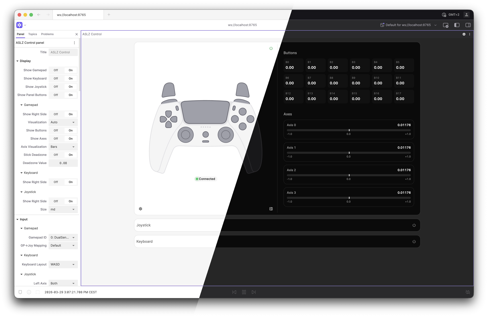
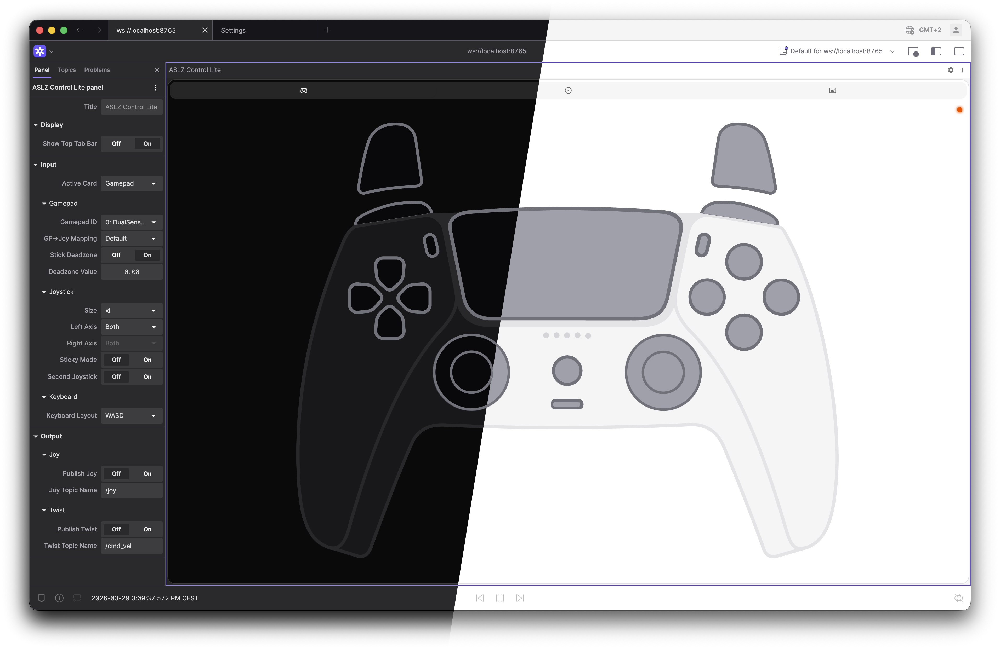

# ASLZ Control Extension

 
[](https://vscode.dev/redirect?url=vscode://ms-vscode-remote.remote-containers/cloneInVolume?url=https://github.com/XENONFFM/foxglove-joystick)

A [Foxglove Studio](https://github.com/foxglove/studio) panel extension for teleoperating robots. It accepts input from a gamepad, keyboard, or on-screen joystick, and publishes `sensor_msgs/Joy` and/or `geometry_msgs/Twist` messages over a Foxglove WebSocket connection.
|  |  |
|:-:|:-:|
|[**❇️ ASLZ Control Panel**](docs/CONTROL_PANEL.md) <br> Optimized for larger panel sizes |  [**❇️ ASLZ Control Panel** ***Lite***](docs/CONTROL_PANEL_LITE.md) <br> Optimized for tiny panel sizes |

## Features

### Input

- **Gamepad:** Reads a locally-connected USB/Bluetooth gamepad via the browser Gamepad API
- **Keyboard:** Maps keyboard keys to axes and buttons
- **Joystick:** On-screen draggable joystick (touch-friendly)

### Output

- Publishes `sensor_msgs/Joy` to a configurable topic.
- Publishes `geometry_msgs/Twist` with a fully configurable axis-to-field mapping (scale, inversion, source index per field).
- Output is gated to the active input source — only one source publishes at a time.

### Gamepad

- Auto-detects connected gamepads.
- Selectable controller-to-Joy transformation mapping (Xbox, PS5, Steam Deck, and generic profiles included).
- Axes and button visualisation with bar or plot display modes.
- Configurable gamepad layout overlay.

### Keyboard

- WASD or arrow-key layouts.
- Live key-press visualisation.
- Outputs non-zero Joy values while keys are held and resets on release.

### Joystick

- Draggable on-screen joystick.
- Configurable axis locking: lock X axis, lock Y axis, or both axes free.
- Multiple size presets (xs → xxl) configurable from Display settings.
- Optional sticky mode (holds last position after release).

### Display / UI

- Each control panel (Gamepad, Keyboard, Joystick) can be shown or hidden independently.
- Settings pane per panel slides in from the right side of that panel.
- Global option to hide all in-panel control buttons (useful for a clean deployment).
- Dark/light/system theme support.

### Settings

All panel options are exposed in the Foxglove settings tree so they persist across sessions and can be managed from the Foxglove settings sidebar.

---

## Panels

This extension provides **two panel variants** optimized for different use cases:

### [ASLZ Control](docs/CONTROL_PANEL.md) — Full-Featured

**Best for** larger displays and larger panel sizes. Displays all control sources in a stacked card layout, all visible at once. Includes advanced Twist mapping and multiple visualization modes.

- Multiple cards stacked on screen
- Collapsible/expandable layout
- Full Twist mapping configuration per source
- Settings panel per card
- Ideal for large displays and detailed teleoperation

**[→ Full Documentation](docs/CONTROL_PANEL.md)**

### [ASLZ Control Lite](docs/CONTROL_PANEL_LITE.md) — Streamlined & Compact

**Best for** touch screens and minimal UIs. Displays one control source at a time via a tab bar. Optimized for small panel sizes on dense dashboards.

- Single card view (tab-based switching)
- Large, touch-friendly controls
- Compact settings—essentials only
- Automatic responsive sizing
- Ideal for small displays and focused workflows

**[→ Full Documentation](docs/CONTROL_PANEL_LITE.md)**

---

## Installation

### Release `.foxe` file

Download the latest `.foxe` from the [Releases](../../releases/latest) page and drag-and-drop it onto Foxglove Studio (desktop or web).

### Build from source

```bash
pnpm install
pnpm run package   # produces a .foxe file
pnpm run local-install  # build + install into local Foxglove desktop
```

### Development in Dev Container

This repository supports VS Code Dev Containers for a consistent local environment.

- Open the repo in VS Code and choose **Reopen in Container**.
- The container includes the required toolchain for development (Node.js, pnpm, TypeScript, ESLint, and Git).
- Run the same commands shown in this README inside the container terminal.

### Dev harness (no Foxglove required)

Iterate on the UI in a browser without launching Foxglove:

```bash
pnpm install
pnpm run dev       # starts Vite at http://localhost:5173
```

The harness renders both panel variants with a mocked Foxglove context, allowing you to test UI changes and settings in real-time. Switch between full and lite panels, adjust initial state, and toggle themes—all without Foxglove.

**[→ Full Dev Harness Documentation](docs/DEV_HARNESS.md)**

---

## Controller Mappings

Different controllers (and the same controller on different platforms) lay out buttons and axes differently. Select the correct mapping in the Gamepad panel settings.

Built-in mappings: **Xbox**, **PS5**, **Steam Deck**, **Generic**.

Built-in mappings are defined in [src/mappings/gamepadJoyTransforms.ts](src/mappings/gamepadJoyTransforms.ts). To add a new one:

1. Use [Gamepad Tester](https://gamepad-tester.com/) to inspect the raw button/axis order of your controller.
2. Add a new entry to `gamepadJoyTransforms` following the existing pattern.
3. The new key will automatically appear in the panel settings dropdown.

> **Note:** the browser Gamepad API reports axes with reversed sign compared to the standard ROS `joy` driver. The extension corrects for this automatically.

---

## Project Structure

```
dev/                  # Vite dev harness (no Foxglove required)
src/
  ControlPanel/       # App (panel)
  ControlPanelLite/   # App (panel)
  components/         # Shared UI components
  config/             # PanelConfig types, defaults, Foxglove settings tree
  hooks/              
  mappings/           # Gamepad→Joy transform definitions + keyboard map JSONs
  types/              
  utils/              
```

---

## Acknowledgements
The ASLZ Control Panel and ASLZ Control Panel Lite are full rewrites of the [foxglove-joystick](https://github.com/anjrew/foxglove-joystick) fork by [Andrew Johnson](https://github.com/anjrew) of the original [foxglove-joystick](https://github.com/joshnewans/foxglove-joystick) by [Josh Newans](https://github.com/joshnewans).
