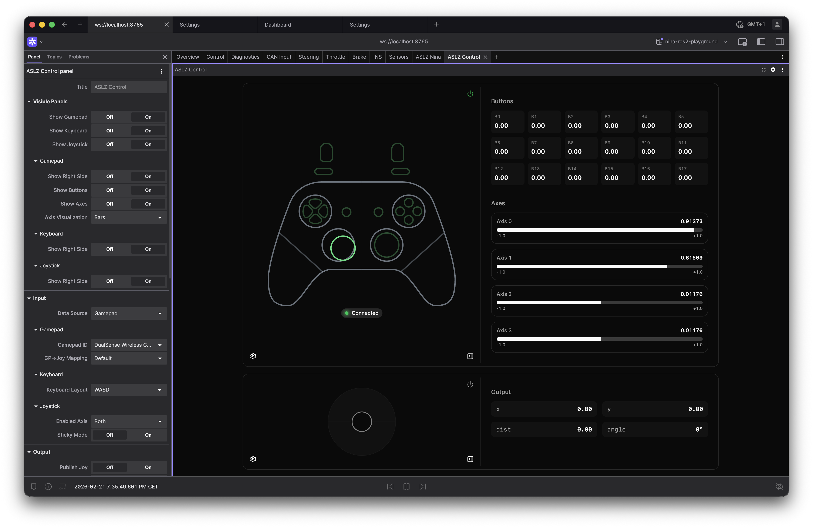

# Control Extension

A [Foxglove Studio](https://github.com/foxglove/studio) panel extension for teleoperating robots. It accepts input from a gamepad, keyboard, or on-screen joystick, and publishes `sensor_msgs/Joy` and/or `geometry_msgs/Twist` messages over a Foxglove WebSocket connection.



---

## Input Sources

Exactly one input source is active at a time. The active source is selected via the power button on each control panel or through the panel settings. Switching source automatically clears any stale output so no unintended commands are sent.

| Source        | Description                                                                 | Typical use                                      |
| ------------- | --------------------------------------------------------------------------- | ------------------------------------------------ |
| **Gamepad**   | Reads a locally-connected USB/Bluetooth gamepad via the browser Gamepad API | Primary teleoperation with a standard controller |
| **Keyboard**  | Maps keyboard keys to axes and buttons                                      | Quick bench-testing when no gamepad is available |
| **Joystick**  | On-screen draggable joystick (touch-friendly)                               | Touchscreen devices or mouse-based control       |
| **Subscribe** | Subscribes to an existing `Joy` topic and visualises it                     | Monitoring/replay of recorded operator input     |

---

## Features

### Output

- Publishes `sensor_msgs/Joy` to a configurable topic.
- Optionally publishes `geometry_msgs/Twist` with a fully configurable axis-to-field mapping (scale, inversion, source index per field).
- Output is gated to the active input source — only one source publishes at a time.

### Gamepad

- Auto-detects connected gamepads.
- Selectable controller-to-Joy transformation mapping (Xbox, PS5, Steam Deck, and generic profiles included).
- Axes and button visualisation with bar or plot display modes.
- Configurable gamepad layout overlay.

### Keyboard

- WASD or arrow-key layouts.
- Live key-press visualisation.
- Outputs non-zero Joy values while keys are held and resets on release.

### Joystick

- Draggable on-screen joystick.
- Configurable axis mode: X only, Y only, or both axes.
- Five size presets (xs → xl) configurable from Display settings.
- Optional sticky mode (holds last position after release).

### Display / UI

- Each control panel (Gamepad, Keyboard, Joystick) can be shown or hidden independently.
- Settings pane per panel slides in from the right side of that panel.
- Global option to hide all in-panel control buttons (useful for a clean deployment).
- Dark/light/system theme support.

### Settings

All panel options are exposed in the Foxglove settings tree so they persist across sessions and can be managed from the Foxglove settings sidebar.

---

## Installation

### Release `.foxe` file

Download the latest `.foxe` from the [Releases](../../releases/latest) page and drag-and-drop it onto Foxglove Studio (desktop or web).

### Build from source

```bash
pnpm install
pnpm run package   # produces a .foxe file
pnpm run local-install  # build + install into local Foxglove desktop
```

### Dev harness (no Foxglove required)

Iterate on the UI in a browser without launching Foxglove:

```bash
pnpm install
pnpm run dev       # starts Vite at http://localhost:5173
```

The harness renders the panel with a mocked Foxglove context. Adjust the initial state in [dev/mockPanelContext.ts](dev/mockPanelContext.ts). Panel settings are accessible via the gear icon in the top-right corner.

---

## Controller Mappings

Different controllers (and the same controller on different platforms) lay out buttons and axes differently. Select the correct mapping in the Gamepad panel settings.

Built-in mappings: **Xbox**, **PS5**, **Steam Deck**, **Generic**.

Built-in mappings are defined in [src/mappings/gamepadJoyTransforms.ts](src/mappings/gamepadJoyTransforms.ts). To add a new one:

1. Use [Gamepad Tester](https://gamepad-tester.com/) to inspect the raw button/axis order of your controller.
2. Add a new entry to `gamepadJoyTransforms` following the existing pattern.
3. The new key will automatically appear in the panel settings dropdown.

> **Note:** the browser Gamepad API reports axes with reversed sign compared to the standard ROS `joy` driver. The extension corrects for this automatically.

---

## Platform Notes

### Steam Deck

See [docs/steamdeck.md](docs/steamdeck.md) for a full step-by-step guide to running Foxglove or the web harness on a Steam Deck with correct controller passthrough.

### Snap (Linux)

The `snap` package of Foxglove Studio does **not** support gamepad input — snaps block joystick device access by default. Use the `.deb` or AppImage version instead.

---

## Project Structure

```
src/
  ControlPanel/       # Top-level panel logic (state, effects, callbacks)
  components/
    Gamepad/          # Gamepad control UI + SVG overlay
    Joystick/         # On-screen joystick
    Keyboard/         # Keyboard input UI
    ui/               # Shared UI primitives (shadcn/ui)
  config/             # PanelConfig types, defaults, Foxglove settings tree
  hooks/              # useGamepad, useGamepadInteractions, usePanPrevention
  mappings/           # Gamepad→Joy transform definitions + keyboard map JSONs
  types/              # Shared TypeScript types
  utils/              # Twist mapping helpers
dev/                  # Vite dev harness (no Foxglove required)
docs/                 # Platform-specific guides
```

---

## Acknowledgements

Based on [studio-extension-gamepad](https://github.com/ARMADAMarineRobotics/studio-extension-gamepad) by [rgov](https://github.com/rgov). The core gamepad polling hook ([src/hooks/useGamepad.ts](src/hooks/useGamepad.ts)) is derived from that project. The rest of the extension has been substantially rewritten.
