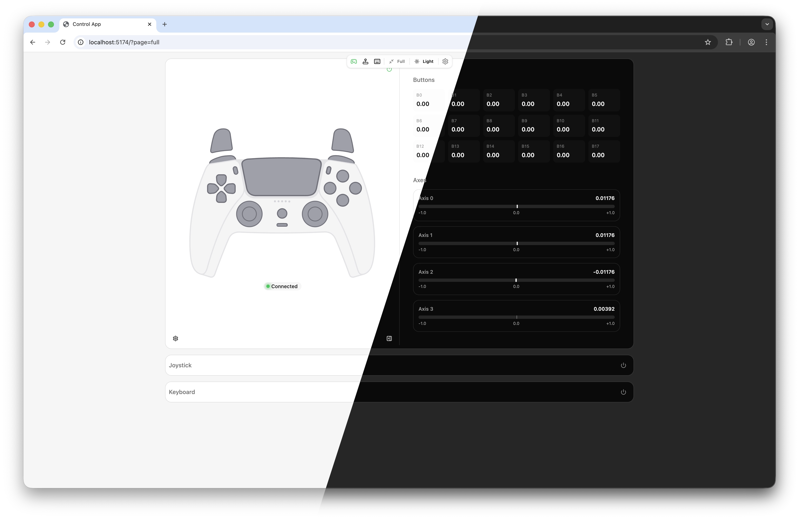
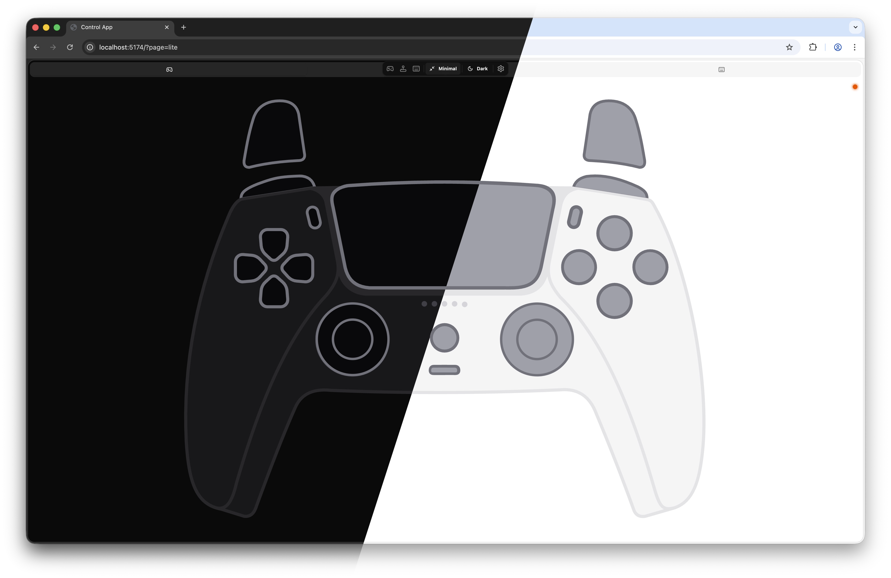

# Development Harness

[](https://vscode.dev/redirect?url=vscode://ms-vscode-remote.remote-containers/cloneInVolume?url=https://github.com/XENONFFM/foxglove-joystick)

The **Development Harness** is a standalone browser-based testing environment for the ASLZ Control panels. It renders both the full and lite panels with a **mocked Foxglove context**, allowing you to iterate on the UI and features without launching Foxglove Studio.

|                          |                          |
| ------------------------ | ------------------------ |
|  |  |

## Quick Start

```bash
pnpm install
pnpm run dev       # starts Vite at http://localhost:5173
```

Open [http://localhost:5173](http://localhost:5173) in your browser. You'll see the full ASLZ Control panel with a development menu at the top.

## Development in Dev Container

Use a VS Code Dev Container for a reproducible setup:

1. Open the repository in VS Code.
2. Run **Dev Containers: Reopen in Container**.
3. In the container terminal, install dependencies and start the harness:

```bash
pnpm install
pnpm run dev
```

The dev container includes the core development tooling (Node.js, pnpm, TypeScript, ESLint, and Git), so you can run lint/build/test commands the same way as on a local machine.

## Features

### Panel Switching

- **Top Overlay Menu** (gray bar): Hover over or focus the bar at the top-center of the page
- **Mode Toggle**: Click "Full" or "Lite" to switch between the two panel variants
- **URL Persistence**: The selected mode is saved to the URL query parameter (`?page=full` or `?page=lite`)

### Mocked Context

The harness provides a complete mock of the Foxglove `PanelExtensionContext`:

- **Settings Editor**: Full settings tree support with live UI update
- **Local Storage**: Panel state is persisted in browser localStorage (key: `foxglove-joystick:harness:panel-state`)
- **No Network**: All rendering is local; no WebSocket or ROS connection required

### Development Menu

When you hover over the top gray bar, a settings sheet appears with:

- **Panel Mode Toggle**: Switch between Full and Lite variants
- **Settings Tree**: View and edit all panel configuration options in real-time
- **Theme Selection**: Dark/Light/System theme toggle
- **Reset State**: Clear localStorage to start fresh

## Configuration

### Initial State

Edit [dev/mockPanelContext.ts](../dev/mockPanelContext.ts) to adjust the default panel state:

```typescript
const defaultInitialState = {
  dataSource: "gamepad",
  publishJoy: false,
  pubJoyTopic: "/joy",
  subJoyTopic: "/joy",
  showHeader: true,
  showInfo: true,
  showButtons: true,
  showAxes: true,
  showGamepad: true,
  showKeyboard: true,
  showJoystick: true,
  keyboardLayout: "wasd",
  // ... other options
};
```

**Note:** Any changes to `defaultInitialState` will be merged with persisted localStorage state. Clear your browser's storage or use the reset button in the dev menu to test new defaults.

### Mock Network Messages

The harness doesn't simulate actual Foxglove topics or ROS messages. If you need to test message subscription or publishing behavior, you can:

1. Modify `mockPanelContext.ts` to implement mock `subscribe()` and `advertise()` callbacks
2. Trigger mock messages from the browser console (e.g., `window.mockJoyMessage = { axes: [...], buttons: [...] }`)
3. Integrate a local WebSocket server for more realistic testing

## File Structure

```
dev/
├── main.tsx                  # Entry point; creates mock context and mounts harness
├── harness.tsx              # Main harness component with panel switcher
├── mockPanelContext.ts      # Mock Foxglove context factory and initial state
└── components/
    └── settings-sheet.tsx   # Dev menu with settings and theme toggle
```

## Workflow

### Iterating on UI

1. **Start the dev server**: `pnpm run dev`
2. **Open browser**: http://localhost:5173
3. **Edit components** in `src/components/`, `src/ControlPanel/`, or `src/ControlPanelLite/`
4. **Vite hot-reloads**: Changes appear instantly in the browser
5. **Adjust settings** via the dev menu to test different configurations

### Testing Panel Variants

- Use the dev menu to switch between **Full** and **Lite** panels
- Test responsive behavior by resizing your browser window
- Verify theme switching (dark/light/system)
- Interact with gamepad, keyboard, and joystick controls

### Simulating Input

Since the harness doesn't connect to a real Foxglove WebSocket:

- **Gamepad Input**: Press actual connected gamepads; the browser Gamepad API is fully functional
- **Keyboard Input**: Interact normally with keyboard controls
- **Joystick**: Drag the on-screen joystick with mouse or touch
- **Settings Changes**: Use the dev menu to modify configuration

## Debugging Tips

### Browser DevTools

- **React Developer Tools**: Install the React DevTools browser extension to inspect component state and props
- **Console**: Use `console.log()` in components to trace execution
- **Network Tab**: (Not needed—no actual network calls)
- **Application Tab**: View localStorage under "Storage" to inspect persisted state

### Clearing State

- **In Dev Menu**: Click the reset button to clear localStorage
- **Manually**: Open browser DevTools → Application → Local Storage → Remove `foxglove-joystick:harness:panel-state`
- **Programmatically**: Run in console:
  ```javascript
  localStorage.removeItem("foxglove-joystick:harness:panel-state");
  location.reload();
  ```

### URL Parameters

- `?page=full` — Force full panel view
- `?page=lite` — Force lite panel view

## Related Commands

```bash
pnpm run dev            # Start dev harness at http://localhost:5173
pnpm run build          # Build extension for Foxglove
pnpm run package        # Package as .foxe file
pnpm run lint           # Run ESLint
pnpm run format:write   # Format code with Prettier
pnpm run test           # Run Jest tests
```

## Next Steps

- After testing in the harness, build and test in Foxglove Studio: `pnpm run local-install`
- For production deployment, package as a `.foxe` file: `pnpm run package`
- Refer to [CONTROL_PANEL.md](CONTROL_PANEL.md) and [CONTROL_PANEL_LITE.md](CONTROL_PANEL_LITE.md) for feature documentation
